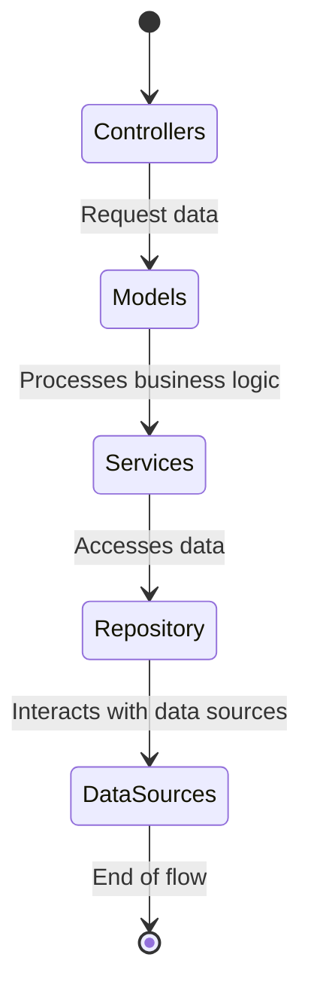
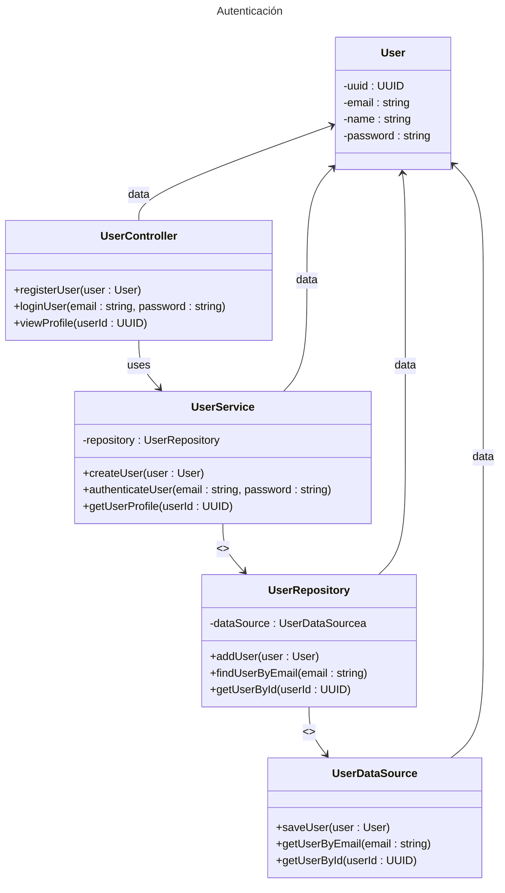
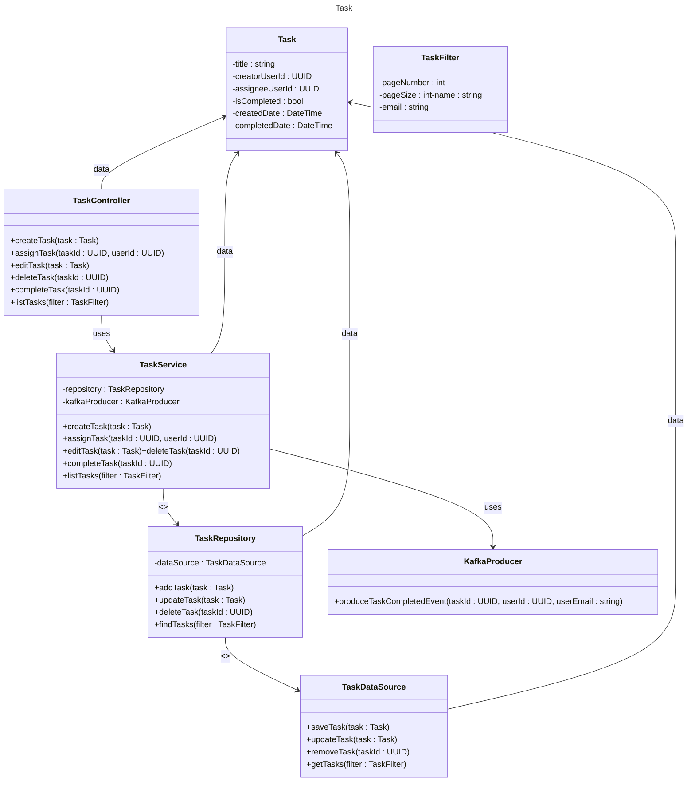
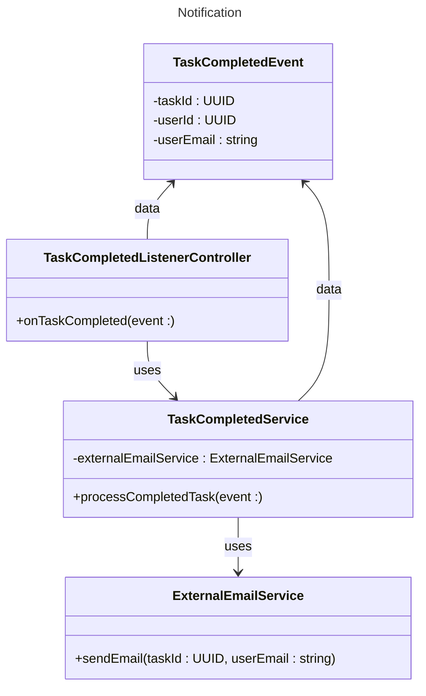

# Domain Model

> Context and vocabulary

Many times the client or the applicant "does not know" what he/she is asking for, or simply has loose ideas that it is up to our side to solve, because it is a challenge, it is simply posed under the [same challenge ](https://github.com/luisphi/reto01_habi) of the domain model.

# Requirements

> Uses cases

### Auth (Users)

| Register | Login | Logout | View Profile |
| -------- | ----- | ------ | ------------ |

### Task (Users)

> TODO: view dataTable & UI/UX (using SSR)

| Create task | Asign Task | Edit Task (own) | Delete task ( own\|as complete?) | Toggle Complete Task |
| ----------- | ---------- | --------------- | -------------------------------- | -------------------- |

### Notifications (System)

| Notifies (mail) task creator when task is marked as complete |
| ------------------------------------------------------------ |

# Analysis

> Discovering classes and responsibilities

# Desing

> Designing classes and responsibilities

## Auth

## Task

## Notification

# Implementation

> Code

# Testing

# Deploy

# Tools

Specification commit messages: [Conventionalcommits](https://www.conventionalcommits.org/en/v1.0.0/) & [Gitmoji](https://gitmoji.dev/)

# Mental draft 

